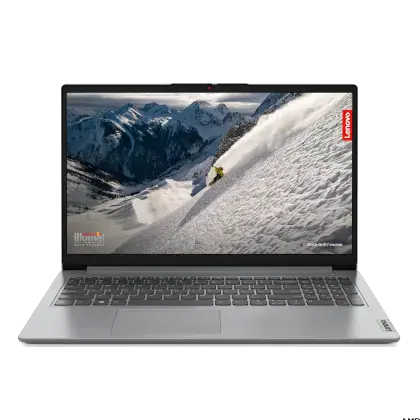

# Projeto de Modernização Tecnológica: Aquisição de Notebooks para a Universidade Estadual do Ceará 

Crateús -- Ceará, 22 de Agosto de 2025.

Ao Reitor H██████████ ███ ██████ S██████.

## Resumo Executivo

Senhor Reitor, 

Em vista da necessidade atual presente no Polo de Crateús, **solicitamos a substituição dos computadores das seguintes salas**: setor administrativo, setor financeiro, laboratório de Informática e laboratório de Química. Devido ao gasto do reparo, solicitamos a substituição dos computadores. O total do número de computadores a serem substituídos é de 30. A substituição trará agilidade em comparação com os computadores velhos que possuímos.

## Introdução e Justificativa

Em vista da necessidade atual presente no Polo de Crateús, **solicitamos a substituição dos computadores das seguintes salas**: setor administrativo, setor financeiro, laboratório de Informática e laboratório de Química. 

A setor administrativo e o setor financeiro concordaram em fazer a solicitação ao senhor pelos seguintes problemas apresentados:

1. O armazenamento dos discos rígidos (HDs) dos computadores não possui capacidade suficiente para as necessidades dos alunos;
2. Os discos rígidos apresentam dados irreparáveis em sua superfície que reduzem a velocidade de acesso de dados, gerando frustação aos usuários das máquinas;
3. As placas de vídeo estão danificadas devido a uso excessivo. A administração suspeita do uso dos computadores para jogar jogos, apesar de nenhum aluno ou professor ter se manifestado;
4. Os computadores possuem mais de 10 anos de idade, o que significa que a maioria dos programas atuais não pode ser instalada e, em menos de 6 meses, o suporte de software da Microsoft(tm) acabará.

Devido aos problemas apresentados e a uma investigação do nosso setor financeiro, acreditamos que a compra de novos computadores usará melhor do dinheiro público do que o reparo das máquinas que possuímos.

**Solicitamos 30 notebooks IdeaPad 1 AMD Ryzen 3 7320U 8GB 256GB SSD**. Acreditamos que esses notebooks são substitutos ideais por possuirem preços baixos e especificações superiores aos computadores atuais. 

## Objetivos

1. Disponibilizar computadores modernos que possam executar programas atuais;
2. Reduzir a frustação dos usuários na utilização dos computadores;
3. Facilitar o transporte das máquinas, caso necessário.

## Especificações Técnicas dos Notebooks

|               | Mínimo   | Recomendado |
|---------------|----------|-------------|
| Processador   | 2,40 GHz | 3 GHz       |
| Memória       | 8 GB     | 16 GB       |
| Armazenamento | 256 GB   | 1 TB        |
| Display       | Full HD  | Full HD     |

## Orçamento Estimado

| Item                        | Preço unitário       | Quantidade | Preço total |
|-----------------------------|----------------------|------------|-------------|
| IdeaPad 1 AMD Ryzen 3 7320U | 2236,99              | 30         | 67109,7     |
| Seguro                      | 350                  | 30         | 4500        |
| Ratreamento                 | 0                    | 0          | 0           |
| Pacote Office               | 0,00 (plano escolar) | 30         | 0           |
| Roteador                    | 200                  | 3          | 600         |
| Capa para notebook          | 40                   | 30         | 1200        |
| Preço de instalação         | 500                  | 1          | 500         |
| Total                       | -                    | -          | 73909,7     |

O seguro inclui o seguro de acidentes em até 6 meses e o seguro de transporte.

## Benefícios Esperados

Os seguintes benefícios são esperados devido à troca para máquinas modernas:
- Maior velocidade de uso
- Acesso a programas modernos 

Os seguintes benefícios são esperados devido à escolha de utilizar notebooks:
- Menor dificuldade de instalação
- Segurança pode ser garantida por utilizar programas gratuitos de rastreamento
- Possibilidade dada aos professores e aos alunos de levar notebooks a outras salas

## Cronograma (Simplificado)
- Planejamento (21/08/2025)
- Compra (22/08/2025)
- Aquisição (11/09/2025)
- Instalação (12/09/2025)

## Considerações Finais

A administação da instituição está ciente de que o valor é elevado em comparação com outros gastos públicos. Porém, acreditamos que nosso mundo está cada vez mais dependente da tecnologia e que negligenciar a educação digital pode afetar a cidadania brasileira. A compra dos notebooks é um investimento para o futuro do país.

Acreditamos também que, apesar de trazerem seus próprios problemas, os benefícios dos notebooks são superiores às suas desvantagens.

Atenciosamente,
Gestão escolar
